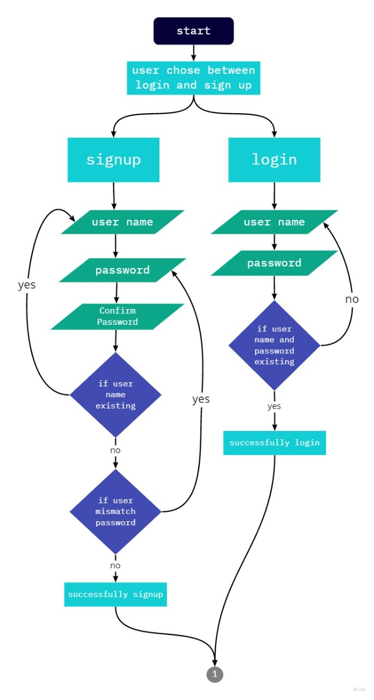

# test
### Flowchart
flowchart1:

### Technologies Used In Application
>- XAMAP
>- Open Trivia database API
>- Cookies
>- MySQL Database
>- Table
>- Forms
>- Languages:
>   - HTML
>   - CSS
>   - JavaScript
>   - Php
